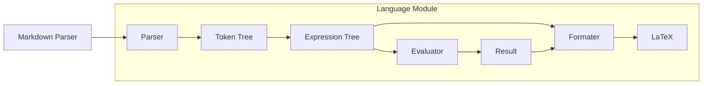

# Markmath
*A calculator for markdown*
## Usage
This project provides a compiler that reads markdown with math expressions and produces markdown with the results of the expressions formatted in LaTeX.
Expressions are written between ^ (caret) symbols. Note that there must be a space after the first caret because of flags (more info about flags in the *language* section). Example: `^ (2+2)*7^ ` → $(2 + 2) \cdot 7 = 28$  
The compiler expects the first argument to be the source document path and the second to be the output path. If the output extention is not *.md*, the compiler will first generate a markdown file and then try to use pandoc to convert it to the desired format.  
By default the compiler will ask the user to name and resolve all *defined units* (more about units in the *language* section). This can be skipped by adding the `--no-resolve` flag.  
By addng the `--live` flag, the compiler will keep running and automatically recompile when the source document is changed. This is always non-resolving like `--no-resolve`.  
## Language
Everything in markmath is an expression. All expressions have a resulting unit and numerical value. 
### Overview of expressions
| Expression      | syntax                                                   | resulting unit                                    | Description                                                                                                              |
|-----------------|----------------------------------------------------------|---------------------------------------------------|--------------------------------------------------------------------------------------------------------------------------|
| Literal         | `42`, `0.6`, `7`, `.2`                                   | None                                              | A Number                                                                                                                 |
| Variable ref    | `var_name`                                               | Unit stored in variable                           | Has value and unit stored in variable                                                                                    |
| Negation        | `-[expr]`                                                | Same as child expression                          | Negates the value                                                                                                        |
| Parenthesies    | `([expr])`                                               | Same as child expression                          | Parenthesies are only rendered when they are significant for the result. Use the `par` function for explicit parenthsies |
| Operator        | `[expr]op[expr]` where `op` is a valid operator          | Depends on child expressions. See *units* section | Applies an operator between two expressions                                                                              |
| Function        | `func([expr], ...)` where `func` is a valid fuction name | None                                              | Applies a function to 0 or more arguments                                                                                |
| Variable setter | `var_name=[expr]`                                        | Same as child expression                          | Sets the value and unit of a variable to the result of the child expression.                                             |
| Unit None       | `[expr]None`                                             | None                                              | Changes result unit to None                                                                                              |
| Unit Literal    | `[expr]"Literal Unit Name"`                              | Literal unit                                      | Changes result unit to the specified literal unit                                                                        |
| Unit Defined    | `[expr]DefinedUnitName`                                  | Defined unit                                      | Changes result unit to the specified defined unit                                                                        |
### Units
Units are a way to display text after numbers. Units are drawn after literal and variable ref expressions, and after the result of a calculation.  
There are 3 types of unit:
* **None**: does not render a unit
* **Literal**: unit name directly defined in expression
* **Defined**: an alias is used in expressions and display name will be defined when compiling  

When an operator is used, the following rules are used to determine the resulting unit:
* If both expressions are of a defined unit, the compiler will prompt the user to resolve them, resulting in a new defined unit. (example: Volt * Amp → Watt)
* If only one expression if of a defined unit, that unit will be the resulting unit
* If no expression is of a defined unit, and only one expression is of a literal unit, that unit will be the resulting unit
* In all other cases the resulting unit is None

### Functions
| signature       | description                                      |
|-----------------|--------------------------------------------------|
| `pi()`          | renders a pi symbol and returns the value of pi  |
| `e()`           | rendres an e and returns eulers number           |
| `par(val)`      | renders parenthesies around the given expression |
| `floor(val)`    | floor function                                   |
| `ceil(val)`     | ceil function                                    |
| `abs(val)`      | absolute value                                   |
| `sqrt(val)`     | square root                                      |
| `nroot(val, n)` | `n` root of `val`                                |
| `log10(val)`    | log10 function                                   |
| `log(val, n)`   | `val` log `n`                                    |
| `sin(deg)`      | sin function expecting degrees                   |
| `cos(deg)`      | cos function expecting degrees                   |
| `tan(deg)`      | tan function expecting degrees                   |
| `asin(deg)`     | asin function returning degrees                  |
| `acos(deg)`     | acos function returning degrees                  |
| `atan(val)`     | atan function returning degrees                  |
| `mod(a, b)`     | `a` mod `b`                                      |
| `p(a, b)`       | `a` rounded to neartest `b`                      |
| `disp(a, b)`    | returns `a` but renders as `b`                   |

### Operators
Operator precedence is as you would expect.   

| operator | description               |
|----------|---------------------------|
| `+`      | plus                      |
| `-`      | minus                     |
| `*`      | multiply                  |
| `/`      | divide with division line |
| `//`     | divide with symbol        |
| `**`     | power                     |

### Flags
When creating a math block in the source file, flags can be added before the first space to change how the expression is rendered:
* `v`: Display variable names instead of their values
* `u`: Disable rendering of units
* `i`: Don't render the expression at all

### Example
```markdown
^ floor((5+6)/2)*.5^
^ speed=90 Meter / 15 Second^
^ speed * 60 Second * 5^
^ disp(325+200, 325 "cm" + 2 Meter) "cm"^
```
$\lfloor \dfrac{5 + 6}{2} \rfloor \cdot 0.5 = 2.5$  

$\dfrac{90\small\text{ m}\normalsize}{15\small\text{ s}\normalsize} = 6\small\text{ m/s}\normalsize$  

$6\small\text{ m/s}\normalsize \cdot 60\small\text{ s}\normalsize \cdot 5 = 1800\small\text{ m}\normalsize$  

$325\small\text{ cm}\normalsize + 2\small\text{ m}\normalsize = 525\small\text{ cm}\normalsize$  

## Project overview
The project consists of two main parts, the language module handles everything related to the math language, and the rest of the codebase handles markdown parsing and CLI interactions.


